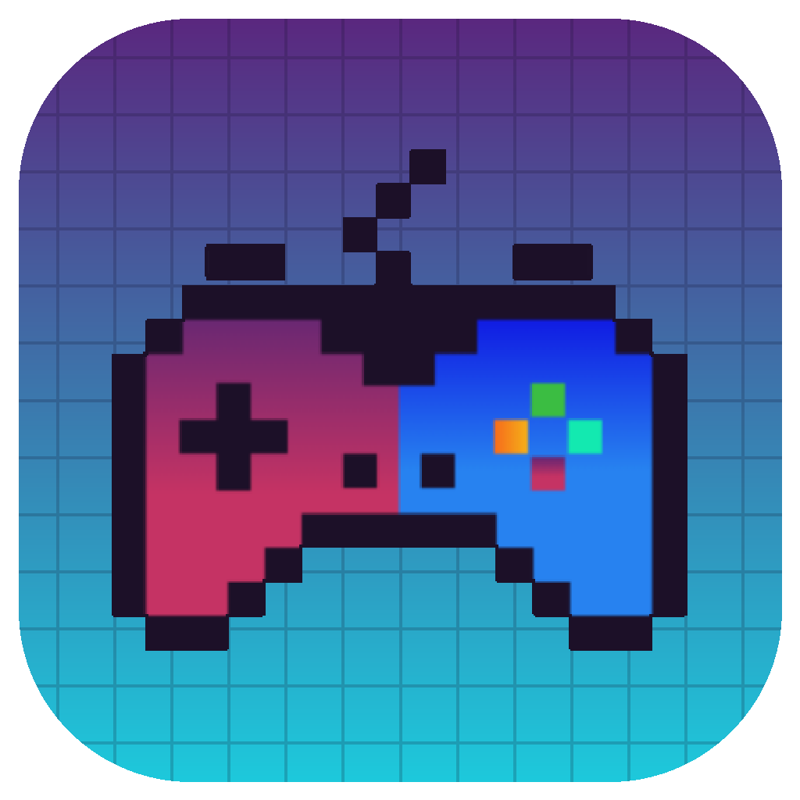

<p align="center">
  
</p>

<h1 align="center">BalancedGaming</h1>

<p align="center">
  A Windows desktop app for tracking gaming sessions and how they affect your mood.<br/>
  Honours Project, BSc (Hons) Software Development, Glasgow Caledonian University (2025–2026)
</p>

<p align="center">
  
  
  
  
</p>


## About

BalancedGaming helps adult gamers track their gaming sessions and monitor how gaming affects their psychological well-being over time. Users log sessions, complete mood assessments before and after play, view trends on a dashboard and set break reminders.

## Features

- **Session tracking** with a start/stop timer
- **Mood assessment** (mood, stress, energy) before and after each session
- **Dashboard** with daily and weekly playtime, mood change and charts comparing mood before and after gaming
- **Break reminders** with configurable intervals, snooze and per-game exceptions
- **Steam integration**: view your Steam library with playtime and import games
- **CSV export** of session history with date filters
- **System tray** support to keep the app running in the background
- **MSI installer** built with WiX Toolset

## Tech Stack

| Area | Technology |
|------|------------|
| Language / runtime | C#, .NET 8 |
| UI | WPF, XAML |
| Architecture | MVVM (CommunityToolkit.Mvvm) for the mood assessment dialog; code-behind in the remaining windows |
| Data | SQLite with Entity Framework Core 9 (code-first migrations) |
| Charts | LiveChartsCore (SkiaSharp) |
| External API | Steam Web API |
| Packaging | WiX Toolset v7 (MSI) |

## Installation

1. Download the latest `BalancedGaming.msi` from the [Releases](https://github.com/RudolfAkopyan/BalancedGaming/releases) page.
2. Run the installer. The app is installed to `Program Files\BalancedGaming` and added to the Start menu.
3. To uninstall, use **Settings → Apps**.

The installer is self-contained, so no separate .NET runtime is required. User data (database and settings) is stored in `%LocalAppData%\BalancedGaming` and is kept when the app is updated or uninstalled.

## Building from Source

**Requirements:** Windows 10/11, Visual Studio 2022 with the .NET desktop development workload, .NET 8 SDK.

1. Clone the repository:
   ```
   git clone https://github.com/RudolfAkopyan/BalancedGaming.git
   ```
2. Open `Balanced_Gaming.sln` in Visual Studio 2022.
3. Restore NuGet packages and run the project (F5).

The SQLite database is created automatically on first launch.

### Steam integration (optional)

To use the Steam library features, enter your Steam Web API key and SteamID64 in the app settings. You can get an API key at <https://steamcommunity.com/dev/apikey>. Your game details must be set to public in your Steam privacy settings.

## Project Structure

```
Balanced_Gaming/
├── Converters/     WPF value converters
├── Data/           Entity Framework DbContext
├── Migrations/     EF Core migrations
├── Models/         Entities, settings and Steam service
├── Resources/      Icons and images
├── ViewModels/     MVVM view models
└── Views/          WPF windows (XAML)
```

## Author

**Rudolf Akopyan**, BSc (Hons) Software Development, Glasgow Caledonian University

[GitHub](https://github.com/RudolfAkopyan) · [LinkedIn](https://www.linkedin.com/in/rudolf-akopyan-b93977257)
